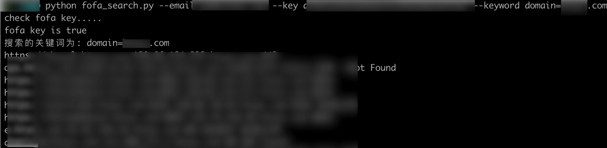
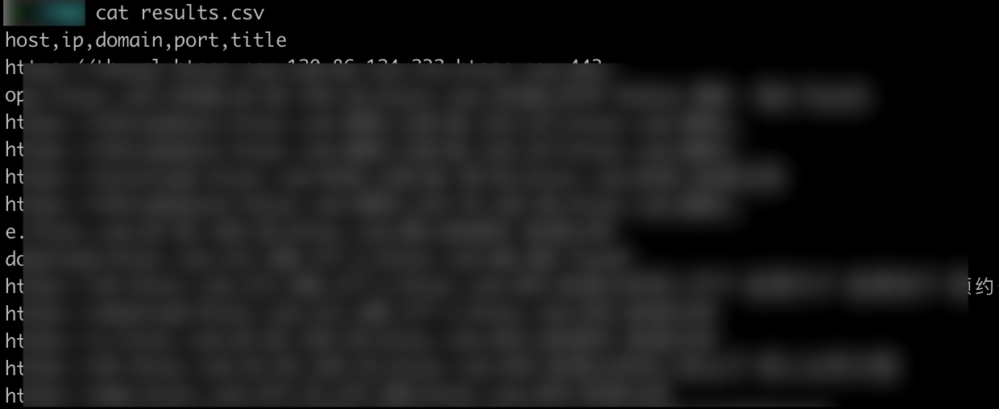
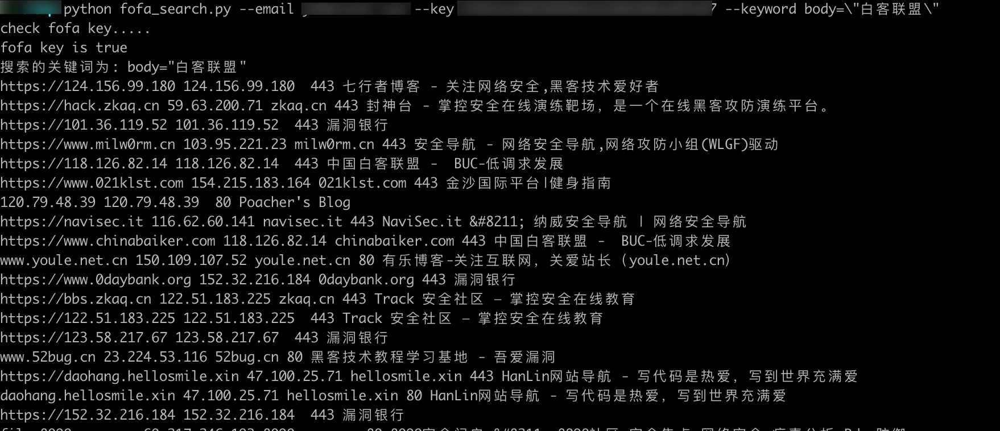

# fofa 搜索工具

利用fofa api搜索host、ip、domain、port、title。

## 用法
```
usage: fofa_search.py [-h] --email EMAIL --key KEY --keyword KEYWORD
                      [--file FILE] [--output [OUTPUT]]
fofa_search.py: error: the following arguments are required: --email, --key, --keyword
```
必要参数：
`--email`：fofa 邮箱
`--key`：fofa key
`--keyword`：fofa 搜索的关键词

可选参数：
`--file`：批量查询的域名或者ip或者其他关键词所在的文件路径
`--output`：结果保存的csv路径

### 举例

单个域名或者ip查询：
```
python fofa_search.py --email key@key.com --key 1234567890qwertyuiopasdfghjjhgf --keyword domain=example.com
```



单个域名或者ip查询并保存结果：

```
python fofa_search.py --email key@key.com --key 1234567890qwertyuiopasdfghjjhgf --keyword domain=example.com --output results.csv
```



多个域名或者IP查询并保存结果：

`--file domains.txt`保存所有域名或者IP的文件

`--keyword $FOFAKEYWORD$`(注意转义)为固定值，目的为替换成文件中的值

```
python fofa_search.py --email key@key.com --key 1234567890qwertyuiopasdfghjjhgf --keyword domain=\$FOFAKEYWORD\$ --output results.csv  --file domains.txt
```

当然，上面所有举例都是查询域名或者IP，keyword也可以更改为你想要搜索的任何符合fofa的语句，如搜索body等等：

```
python fofa_search.py --email key@key.com --key 1234567890qwertyuiopasdfghjjhgf --keyword body=\"白客联盟\"
```




也可以配合`--file`和`$FOFAKEYWORD$`搜索你想要搜索的任何东西，如：

```
python fofa_search.py --email key@key.com --key 1234567890qwertyuiopasdfghjjhgf --keyword body=\"\$FOFAKEYWORD\$\" --file 111.txt --output test.csv
```

`111.txt`内容为你想要搜索的内容，会自动把固定值`$FOFAKEYWORD$`进行替换并组合成fofa搜索语法：


